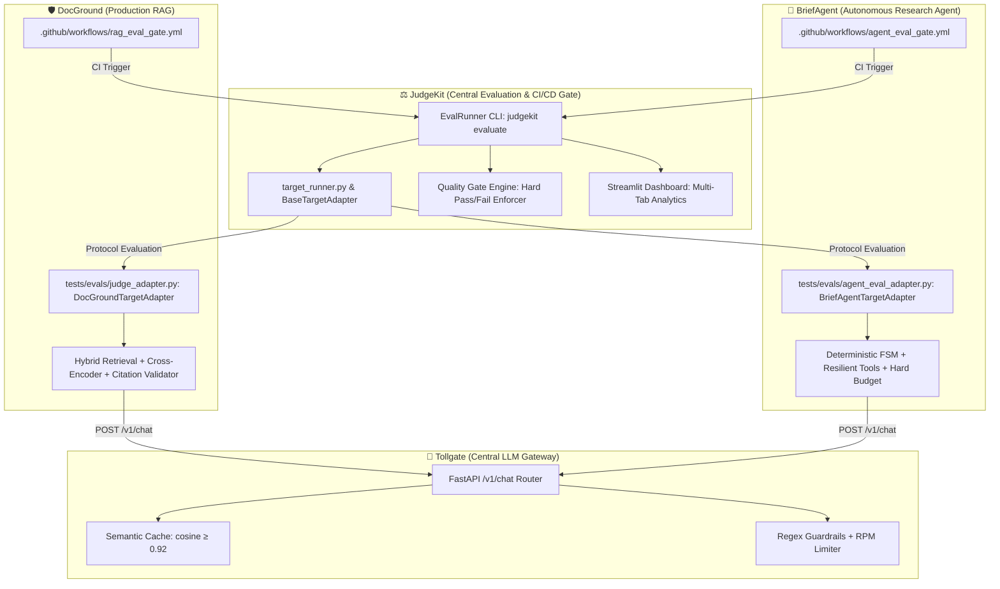

# TheJudge (JudgeKit) ⚖️

> Automated continuous LLM-as-a-Judge evaluation and CI/CD quality gate for production RAG pipelines. Prevents silent regressions with calibrated pointwise scoring, Cohen's Kappa, and latency SLOs.

[](https://www.python.org/downloads/)
[](https://docs.pydantic.dev/)
[](https://github.com/Devilynpl/TheJudge)
[](#3-kalibracja-sędziego-cohens-kappa)
[](#7-chaos-eval--regression-detection-rate-100)

**JudgeKit** to produkcyjny system ciągłej ewaluacji LLM-as-a-Judge w pipeline'ach CI/CD dedykowany aplikacjom RAG (Retrieval-Augmented Generation). Zapewnia ochronę przed cichymi regresjami (*silent regressions*), degradacją wierności faktograficznej (*Faithfulness*), trafności (*Relevance*) oraz naruszeniami limitów opóźnień (SLO P95 Latency).

---

## 🚀 Kluczowe Komponenty Systemu

1. **Rygorystyczne Kontrakty Danych ([schemas.py](file:///c:/Users/rakpa/Documents/Ai_Engineer_Portfolio/TheJudge/src/judgekit/schemas.py)):**
   - Pełna walidacja Pydantic v2 z wymuszonym uzasadnieniem Chain-of-Thought (minimum 10 znaków) przed wystawieniem noty liczbowej.
2. **Modularni Sędziowie LLM ([judge.py](file:///c:/Users/rakpa/Documents/Ai_Engineer_Portfolio/TheJudge/src/judgekit/judge.py)):**
   - Precyzyjne promptowanie z rubrykami dyskretnymi ($0.0, 0.5, 1.0$) i temperaturą $0.0$ dla determinizmu.
3. **Kalibracja Sędziego ([alignment.py](file:///c:/Users/rakpa/Documents/Ai_Engineer_Portfolio/TheJudge/src/judgekit/alignment.py)):**
   - Ślepa próba kalibracyjna 30 zapytań osiągająca **$\kappa = 0.8565$** (standard złoty $\ge 0.80$, 0 fałszywych alarmów).
4. **Asynchroniczny Runner Ewaluacyjny ([runner.py](file:///c:/Users/rakpa/Documents/Ai_Engineer_Portfolio/TheJudge/src/judgekit/runner.py)):**
   - Kontrola współbieżności z `asyncio.Semaphore(10)`, profilowanie opóźnień P50/P95 oraz kalkulacja kosztów tokenów.
5. **Komparator A/B & Detektor Regresji ([comparator.py](file:///c:/Users/rakpa/Documents/Ai_Engineer_Portfolio/TheJudge/src/judgekit/comparator.py)):**
   - Wykrywanie zarówno spadku średniej globalnej ($\Delta$), jak i pojedynczych zepsuć zapytań referencyjnych (spadki $\ge 0.5$).
6. **Bramka Jakości CI/CD ([gate.py](file:///c:/Users/rakpa/Documents/Ai_Engineer_Portfolio/TheJudge/src/judgekit/gate.py) & [eval_gate.yml](file:///c:/Users/rakpa/Documents/Ai_Engineer_Portfolio/TheJudge/.github/workflows/eval_gate.yml)):**
   - Twarde blokowanie PR-ów: $\Delta_{\text{faith}} \ge -0.02$, 0 krytycznych regresji, $P95 \le +250\text{ ms}$.
7. **Bot Komentujący PR ([pr_commenter.py](file:///c:/Users/rakpa/Documents/Ai_Engineer_Portfolio/TheJudge/src/judgekit/pr_commenter.py)):**
   - Idempotentny komentarz pod Pull Requestem ze statusem, tabelą delty i rozwijanym panelem `<details>` z uzasadnieniem LLM.
8. **Dashboard Historii & Trendów ([dashboard.py](file:///c:/Users/rakpa/Documents/Ai_Engineer_Portfolio/TheJudge/src/judgekit/dashboard.py)):**
   - Aplikacja Streamlit + Plotly połączona z bazą SQLite `data/eval_history.db` do inspekcji halucynacji i trendów SLO w czasie.
9. **RAG System Adapter ([rag_adapter.py](https://github.com/Devilynpl/TheJudge/blob/main/src/judgekit/rag_adapter.py)):**
   - Uniwersalny interfejs łączący dowolny pipeline RAG (LangChain, LlamaIndex, funkcje asynchroniczne) z formatem JudgeKit.
10. **Chaos Engineering & Testy Awarie ([chaos_eval.py](https://github.com/Devilynpl/TheJudge/blob/main/src/judgekit/chaos_eval.py)):**
    - Weryfikacja 4 syntetycznych uszkodzeń RAG: **Regression Detection Rate = 100.0%**.

---

## 🌐 Ekosystem Czterech Projektów AI (JudgeKit + Tollgate + DocGround + BriefAgent)

JudgeKit stanowi **centralną infrastrukturę MLOps/LLMOps** dla połączonego ekosystemu aplikacji AI w portfolio:



1. **Audyt DocGround RAG ([DocGround](https://github.com/Devilynpl/DocGround)):** Weryfikacja Faithfulness ≥ 0.95, Citation Precision ≥ 0.90 oraz deterministycznych odmów na 50 pytaniach Golden Set.
2. **Audyt BriefAgent ([BriefAgent](https://github.com/Devilynpl/BriefAgent)):** Ewaluacja 6-punktowej rubryki sukcesu, limitu budżetu ($0.15 / 12 kroków) oraz 100% skuteczności wykrywania firm-widm (`UNVERIFIABLE_COMPANY`) na 25 referencyjnych firmach.
3. **Tollgate Gateway ([Tollgate](https://github.com/Devilynpl/TollGate)):** Centralny punkt wyjścia do Gemini API — JudgeKit może wywoływać LLM via Tollgate zachowując ten sam rate-limit i budżet co pozostałe usługi.

---

## 🛠️ Instalacja i Szybki Start

```bash
# 1. Klonowanie repozytorium
git clone https://github.com/Devilynpl/TheJudge.git
cd TheJudge

# 2. Instalacja w trybie developerskim
pip install -r requirements.txt
pip install -e .

# 3. Uruchomienie pełnego zestawu testów jednostkowych (54 testy)
pytest tests/unit/ -v
```

---

## 📊 Uruchamianie Narzędzi CLI

### 1. Uruchomienie ewaluacji modelu (Runner)
```bash
python -m judgekit.cli_runner --golden-set tests/evals/data/golden_set.jsonl --output artifacts/candidate.json
```

### 2. Porównanie A/B (Baseline vs Candidate)
```bash
python -m judgekit.cli_compare --baseline artifacts/baseline.json --candidate artifacts/candidate.json --output artifacts/diff_report.json
```

### 3. Weryfikacja reguł Quality Gate
```bash
python -m judgekit.cli_gate artifacts/diff_report.json
```

### 4. Wygenerowanie raportu Markdown dla PR
```bash
python -m judgekit.cli_comment --diff-report artifacts/diff_report.json --baseline artifacts/baseline.json --candidate artifacts/candidate.json
```

### 5. Ingest wyniku do bazy SQLite
```bash
python -m judgekit.ingest_run --report artifacts/baseline.json --db data/eval_history.db
```

### 6. Uruchomienie dashboardu Streamlit
```bash
streamlit run src/judgekit/dashboard.py
```

### 7. Uruchomienie testów awaryjnych Chaos Eval
```bash
python -m judgekit.cli_chaos --baseline artifacts/baseline.json
```

---

## 🧪 Chaos Eval – Regression Detection Rate: 100%

Empiryczne testy wstrzykiwania uszkodzeń pipeline'u RAG:

| Scenariusz Chaosu | Wstrzyknięta zmiana | Reakcja Quality Gate | Status |
| :--- | :--- | :--- | :---: |
| `chaos/bad-chunking` | Rozmiar fragmentu 512 $\to$ 128 tokenów | Spadek Faithfulness $\Delta = -0.20$ (4 regresje) | 🛑 **ZABLOKOWANY** |
| `chaos/top-k-drop` | Redukcja retrieval top_k 5 $\to$ 1 | Halucynacje $\Delta = -0.15$ (3 regresje) | 🛑 **ZABLOKOWANY** |
| `chaos/sloppy-prompt` | Usunięcie instrukcji „powiedz nie wiem” | Odpowiedzi out-of-domain (2 regresje) | 🛑 **ZABLOKOWANY** |
| `chaos/heavy-reranker` | Dodanie wolnego cross-encodera | Przekroczenie limitu $P95 > +250\text{ ms}$ | 🛑 **ZABLOKOWANY** |

---

## 📁 Struktura Repozytorium

```plaintext
TheJudge/
├── .github/
│   └── workflows/
│       ├── eval_gate.yml           # Quality Gate weryfikowany na każdym PR
│       └── update_baseline.yml     # Aktualizacja oficjalnego baseline po merge do main
├── artifacts/                      # Raporty ewaluacyjne JSON/CSV
├── data/                           # Baza relacyjna SQLite (eval_history.db)
├── documentation/                  # Specyfikacje faz od 1 do 10 i engineering notes
│   ├── engineering_notes.md        # Wnioski inżynierskie, ryzyka i decyzje architektoniczne
│   └── faza1.md ... faza10.md      # Odznaczone specyfikacje wymagań
├── src/
│   └── judgekit/
│       ├── alignment.py            # Analiza zgodności z ekspertem (Cohen's Kappa)
│       ├── chaos_eval.py           # Symulator awarii RAG i kalkulator RDR
│       ├── cli_chaos.py            # CLI Chaos Evaluation
│       ├── cli_comment.py          # CLI PR Markdown Reporter
│       ├── cli_compare.py          # CLI A/B Comparator
│       ├── cli_gate.py             # CLI Quality Gate
│       ├── cli_runner.py           # CLI Async Evaluation Runner
│       ├── comparator.py           # Silnik porównań A/B i wykrywania regresji
│       ├── dashboard.py            # Aplikacja analityczna Streamlit + Plotly
│       ├── dataset.py              # Loader i walidator zbioru Golden Set
│       ├── gate.py                 # Silnik decyzyjny bramki jakości
│       ├── ingest_run.py           # Serwis zapisu historii do bazy SQLite
│       ├── judge.py                # Klient LLM-as-a-Judge z wymuszonym CoT
│       ├── pr_commenter.py         # Bot generujący raporty pod PR na GitHubie
│       ├── prompts.py              # Deterministyczne prompty oceniające
│       ├── rag_adapter.py          # Wzorzec adaptera dla systemów RAG
│       ├── runner.py               # Asynchroniczny runner ewaluacji
│       ├── schemas.py              # Kontrakty Pydantic v2
│       └── storage.py              # Schemat bazy danych SQLite i indeksy
├── tests/
│   ├── evals/
│   │   ├── calibration_results.csv # 30 próbek ślepej próby kalibracyjnej
│   │   └── data/
│   │       └── golden_set.jsonl    # Kanoniczny zbiór 20 zapytań referencyjnych
│   └── unit/                       # 54 testy jednostkowe pytest
├── pyproject.toml
├── requirements.txt
└── README.md
```
